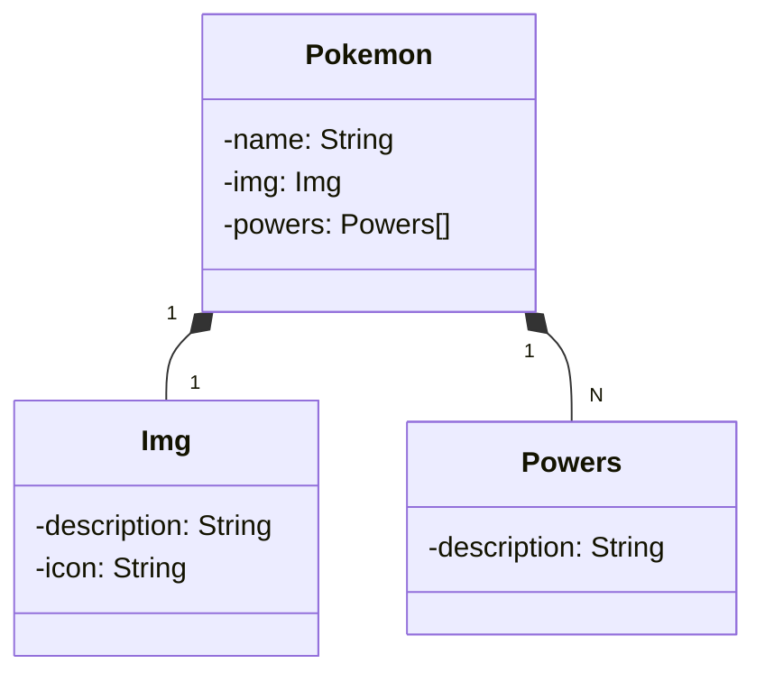

# Santander Dev Week 2023

Java Restful API criada para o Santander Dev Week 2023 com base nas aulas da DIO, mas modificada para simular uma API de Pokemons.

# Principais tecnologias:

 Utilizaremos a versão LTS mais recente do Java para tirar vantagem das últimas inovações que essa linguagem robusta oferece;

 Trabalharemos com a mais nova versão do Spring Boot, que maximiza a produtividade do desenvolvedor

 Exploraremos como essa ferramenta pode simplificar nossa camada de acesso aos dados e integração Database;

 Vamos criar uma documentação usando OpenAPI (Swagger), combinando a alta produtividade que o Spring oferece;

 facilita o deploy e monitoramento de nossas soluções na nuvem oferecendo e pipelines de CI/CD.

##Diagrama de Classes

# Importante

Esta API ficará disponível no Railway por um período de tempo limitado, mas este é um código-fonte aberto. Portanto, sintam-se à vontade para cloná-lo e modificá-lo.

-URL de Produção: [https://sdw-2023-prd.up.railway.app/users/1](https://sdw-2023-api-pokemon-prd.up.railway.app/pokemons/1)

Se você preferir usar o protocolo SSH para comunicação com o repositório, siga as etapas abaixo:

Abra o terminal ou prompt de comando.

Navegue até o diretório do projeto.

Execute o seguinte comando para mudar a URL remota para SSH:

[`git@github.com:ulisalves/pokeapi_santander_dev_week_2023.git`](#git@github.com:ulisalves/pokeapi_santander_dev_week_2023.git).